# Voice Navigation System - Mermaid Diagrams

## 1. Overall System Architecture


## 2. Voice Control Initialization Flow

```mermaid
sequenceDiagram
    participant User
    participant Keyboard
    participant BG as background.js
    participant Tab as Active Tab
    participant VC as voiceControl.js
    participant Storage as Chrome Storage
    participant SR as SpeechRecognition
    participant SS as SpeechSynthesis

    User->>Keyboard: Press Ctrl+Shift+V
    Keyboard->>BG: Keyboard Event
    BG->>BG: Check cooldown (2s)
    BG->>Tab: Inject voiceControl.js
    Tab->>VC: Execute Script
    
    VC->>VC: Check wsVoiceControlActive flag
    alt Already Active
        VC-->>Tab: Skip injection
    else Not Active
        VC->>VC: Set wsVoiceControlActive = true
        VC->>VC: Create UI (wrapper, button)
        VC->>VC: Initialize element cache
        VC->>VC: Setup MutationObserver
        VC->>SR: Create SpeechRecognition instance
        VC->>SS: Load voices
        
        VC->>Storage: Get welcomedDomains
        Storage-->>VC: Return domain list
        
        alt New Domain
            VC->>SS: Speak "Voice control activated..."
            VC->>Storage: Add current domain
        else Known Domain
            VC->>VC: Start silently
        end
        
        VC->>SR: Start recognition
        SR-->>User: Listening indicator (🔴)
    end
```



## 3. Command Processing Pipeline


## 4. Element Detection & Caching System


## 5. Click Command Flow (Detailed)


## 6. Navigation Commands Flow

```mermaid
flowchart LR
    A[User Says Command] --> B{Command Type}
    
    B -->|"back"<br/>"go back"<br/>"previous page"| C1[action = 'back']
    B -->|"forward"<br/>"go forward"<br/>"next page"| C2[action = 'forward']
    B -->|"reload"<br/>"refresh page"| C3[action = 'reload']
    
    C1 --> D1[NLP Detection<br/>spacy_server.py]
    C2 --> D1
    C3 --> D1
    
    D1 --> E1[Frontend Receives]
    
    E1 --> F{Action Router}
    
    F -->|back| G1[Random Response:<br/>"Going back"<br/>"Heading back"<br/>"Back we go"<br/>etc.]
    F -->|forward| G2[Random Response:<br/>"Going forward"<br/>"Moving forward"<br/>etc.]
    F -->|reload| G3[Random Response:<br/>"Reloading page"<br/>"Refreshing page"<br/>etc.]
    
    G1 --> H1[smartSpeak response]
    G2 --> H1
    G3 --> H1
    
    H1 --> I[Wait 300-500ms]
    
    I --> J{Execute}
    
    J -->|back| K1[window.history.back]
    J -->|forward| K2[window.history.forward]
    J -->|reload| K3[window.location.reload]
    
    K1 --> L[Page Navigation]
    K2 --> L
    K3 --> L
    
    L --> M[cleanup event fires]
    M --> N[Stop recognition]
    M --> O[Cancel speech]
    
    L --> P[New Page Loads]
    P --> Q[webNavigation.onCompleted<br/>background.js]
    Q --> R[Auto re-inject voiceControl.js]
    R --> S[Voice control active again]
    
    S --> T{Same Domain?}
    T -->|Yes| U[Start silently]
    T -->|No| V[Speak welcome message]

    style C1 fill:#ffebee
    style C2 fill:#e3f2fd
    style C3 fill:#e8f5e9
    style K1 fill:#ff5722,color:#fff
    style K2 fill:#2196f3,color:#fff
    style K3 fill:#4caf50,color:#fff
```

## 7. Scroll Command with Smart Detection


## 8. File Structure & Responsibilities


## 9. Key Data Structures


## 10. Error Handling & Recovery


## Summary

### Key Files:

1. **extension/dist/voiceControl.js** (2725 lines)
   - Main content script injected into web pages
   - Handles speech recognition, UI, element detection, action execution

2. **extension/src/background/background.js** (303 lines)
   - Service worker managing injection and tab lifecycle
   - Listens for keyboard shortcuts (Ctrl+Shift+V)

3. **backend/nlp/spacy_server.py** (1000 lines)
   - Flask server on port 5001
   - NLP processing with spaCy
   - Intent classification and entity extraction

### Key Technologies:

- **Web Speech API**: SpeechRecognition + SpeechSynthesis
- **spaCy**: Natural language processing (en_core_web_sm model)
- **Chrome Extension API**: Manifest V3, scripting, storage, tabs
- **MutationObserver**: DOM change detection
- **Flask**: Python REST API server

### Data Flow:

User Speech → SpeechRecognition → voiceControl.js → spaCy NLP → Action JSON → Element Search → DOM Manipulation → SpeechSynthesis → User Feedback
